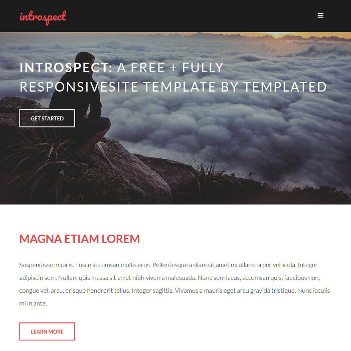

# Introspect Theme for Grav

This Grav theme is a port of the [Introspect theme](https://templated.co/introspect) by [TEMPLATED](https://templated.co). Introspect is an ultra-minimal landing page template with a big cover photo.

# Features

* Fully Responsive
* Automatic and custom navigation menus included
* Built on HTML5/CSS3
* Icons by Font Awesome
* Simple Form Support
* Released for Free Under the Creative Commons Attribution 3.0

## Basic Setup for a New Grav Site

The simplest way to install Introspect theme for Grav is to download and install the Introspect Skeleton package:

1. [Download Introspect Skeleton](http://getgrav.org/downloads/skeletons#extras)
2. Unzip the package into your web root folder.
3. Point your browser at the folder.
4. Job done!

**TIP:** Check out the [general Grav Installation Instructions](http://learn.getgrav.org/basics/installation) for more details on this process.

---

## Existing Grav site

It is possible to install just the theme, but page content will need to reference the [Introspect theme](https://github.com/Aisbergg/grav-theme-introspect)'s supported templates.  It is strongly advised to at least install the Introspect Skeleton package to see the theme's capabilities in action.

To install **just** the theme, you will want to do so via the [Grav Package Manager (GPM)](http://learn.getgrav.org/advanced/grav-gpm) through your system's Terminal (also called the command line).  From the root of your Grav install type:

    bin/gpm install introspect

This will install the Introspect theme into your `/user/themes` directory within Grav. Its files can be found under `/your/site/grav/user/themes/introspect`.

You can find more information bout this process, including manual installation instructions, by visiting the [project page for the stand-alone Grav theme](https://github.com/Aisbergg/grav-theme-introspect).

# Contact Form Configuration
For contact form configuration instructions please refer to [official documentation](http://learn.getgrav.org/advanced/contact-form). Make sure you installed Email and Form plugin though.
